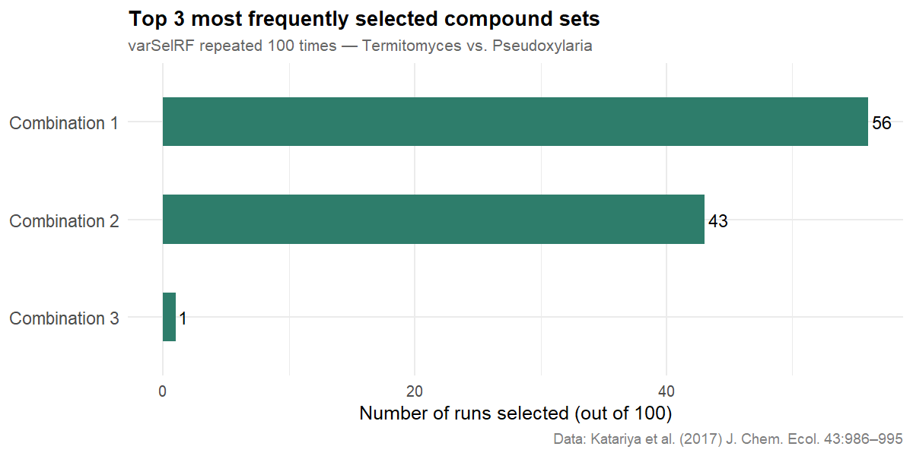
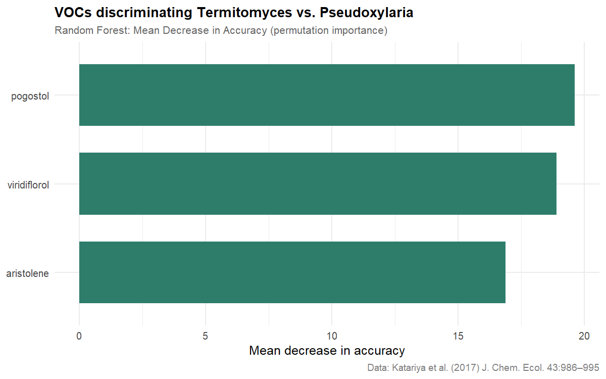
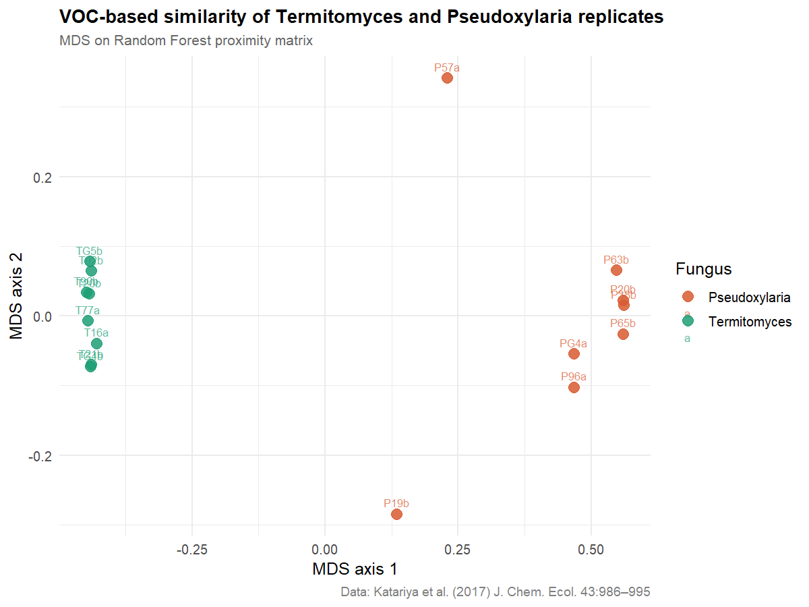
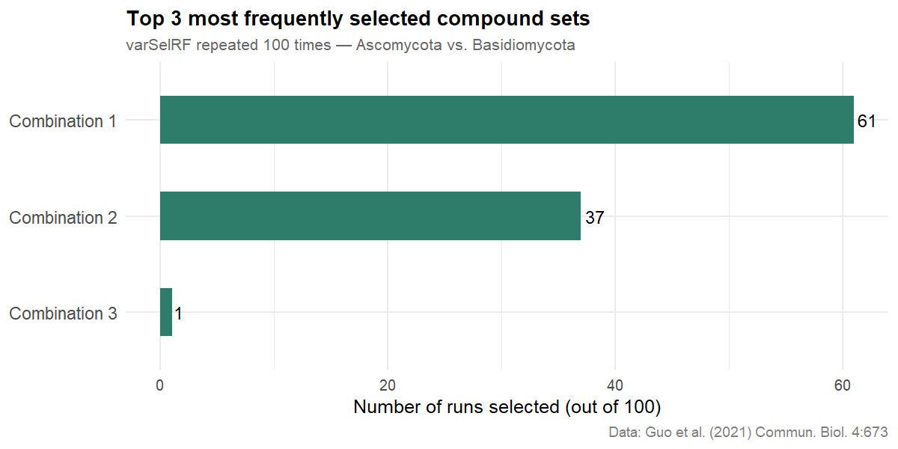
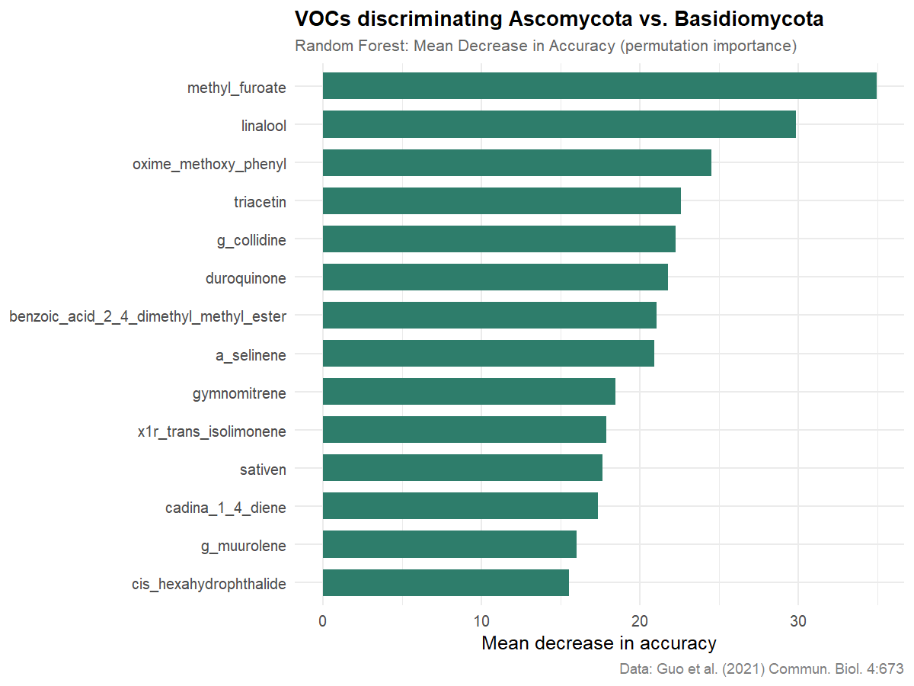
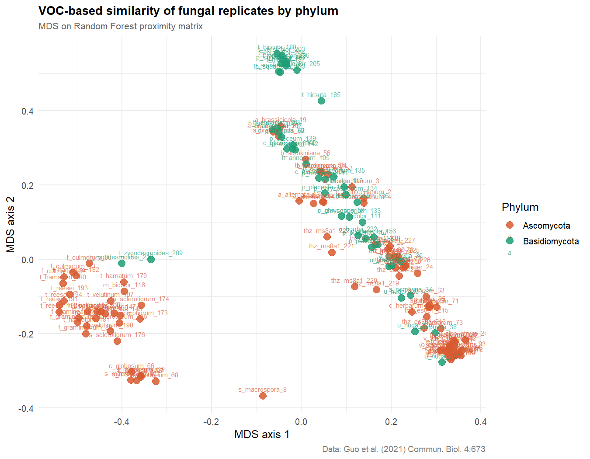

Can you smell the difference? Identifying fungal discriminating
volatiles using Random Forest classification
================
Lakshya Katariya
2026-06-07

## Overview

Fungi can communicate chemically through volatile organic compounds
(VOCs). In [Katariya et
al. (2017)](https://link.springer.com/article/10.1007/s10886-017-0902-4),
we showed that fungus-farming termites discriminate their crop fungus
(*Termitomyces*) from a parasitic weed (*Pseudoxylaria*) using VOC
profiles alone — without visual contact. Random Forest classification on
GC-MS chemical profiles identified the candidate volatile compounds
driving that discrimination.

This document has two parts:

- **Part 1** replicates the Random Forest analysis from Katariya et
  al. (2017) using the published supplementary data from that paper —
  *Termitomyces* vs. *Pseudoxylaria* VOC profiles.
- **Part 2** extends the same analytical framework to a broader public
  dataset from [Guo et
  al. (2021)](https://doi.org/10.1038/s42003-021-02198-8), asking
  whether VOC profiles discriminate fungal phyla (Ascomycota
  vs. Basidiomycota) across 39 species.

Random Forest is used throughout as a classification tool — the goal
here is simpler — identify candidate discriminating compounds (not to
build a predictive model for deployment).

------------------------------------------------------------------------

## Setup

``` r
library(tidyverse)     # dplyr, tidyr, tibble, ggplot2, forcats
library(readxl)        # read Excel files
library(varSelRF)      # iterative variable selection via Random Forest
library(janitor)       # clean_names() for column name cleaning
library(parallel)      # detect available CPU cores
library(doParallel)    # parallel backend for foreach loops
library(foreach)       # foreach loop syntax
```

------------------------------------------------------------------------

# Part 1: Replication — *Termitomyces* vs. *Pseudoxylaria*

## Data source

VOC emission data are taken from Supplementary Table S1 of:

> Katariya L, Ramesh PB, Gopalappa T et al. (2017). *Fungus-Farming
> Termites Selectively Bury Weedy Fungi that Smell Different from Crop
> Fungi.* Journal of Chemical Ecology 43:986–995.
> <https://doi.org/10.1007/s10886-017-0902-4>

The table reports proportional VOC emission intensities for 8
*Termitomyces* replicates (crop fungus) and 8 *Pseudoxylaria* replicates
(weedy fungus), across 41 identified volatile compounds from a
representative GC-MS dataset (dataset \#7 in the paper). The original
analysis used 16 datasets; this replication uses dataset \#7 as a
representative example, consistent with the paper’s Fig. 2c.

``` r
# Data entered directly from Table S1 of Katariya et al. (2017)
# Rows = compounds, Columns = replicates
# T = Termitomyces (crop), P = Pseudoxylaria (weed)

voc_p1 <- tribble(
  ~compound,               ~T16a,  ~T20b,  ~T21b,  ~T77a,  ~T90b,  ~T92b,  ~TG4b,  ~TG5b,  ~P19b,  ~P20b,  ~P38b,  ~P57a,  ~P63b,  ~P65b,  ~P96a,  ~PG4a,
  "octen_3_ol",            0.105,  0.033,  0,      0,      0.070,  0.014,  0.620,  0.037,  0.019,  0.018,  0.179,  0,      0.006,  0,      0.013,  0,
  "x3_octanone",           0.181,  0.080,  0,      0,      0.243,  0.035,  0.376,  0.056,  0.011,  0.031,  0.068,  0.021,  0.025,  0.001,  0.025,  0.033,
  "x3_octanol",            0,      0,      0,      0,      0.006,  0,      0.004,  0,      0,      0,      0,      0,      0,      0,      0,      0,
  "benzaldehyde",          0,      0,      0,      0,      0.0004, 0,      0,      0,      0.008,  0,      0.009,  0.048,  0.003,  0.065,  0.009,  0.084,
  "phenylethanal",         0,      0,      0,      0,      0,      0,      0,      0,      0,      0,      0.002,  0,      0.0001, 0,      0.006,  0,
  "x2_phenylethanol",      0,      0,      0,      0,      0,      0,      0,      0,      0,      0,      0,      0,      0,      0.008,  0.010,  0,
  "benzene_acetonitrile",  0.173,  0,      0,      0.002,  0,      0,      0,      0.736,  0,      0,      0,      0,      0,      0,      0,      0,
  "isocyclobazzanene",     0.128,  0.077,  0,      0.372,  0,      0,      0,      0,      0,      0,      0,      0,      0,      0,      0,      0,
  "bicycloelemene",        0,      0,      0.046,  0.070,  0.070,  0,      0,      0,      0,      0,      0,      0,      0,      0,      0,      0,
  "a_cubebene",            0.219,  0.202,  0.039,  0,      0.052,  0.039,  0,      0,      0,      0,      0,      0,      0,      0,      0,      0,
  "cyclosativene",         0,      0,      0.037,  0,      0.029,  0,      0,      0,      0,      0,      0,      0,      0,      0,      0,      0,
  "b_cubebene",            0,      0.102,  0.104,  0,      0.045,  0.041,  0,      0,      0,      0,      0,      0,      0,      0,      0,      0,
  "a_isocomene",           0,      0,      0.062,  0,      0.039,  0.029,  0,      0,      0,      0,      0,      0,      0,      0,      0,      0,
  "aristolene",            0,      0,      0,      0,      0,      0,      0,      0,      0.133,  0.337,  0.203,  0,      0.053,  0.095,  0.092,  0.151,
  "cis_thujopsene",        0,      0,      0,      0,      0,      0,      0,      0,      0.039,  0,      0.091,  0,      0.020,  0.012,  0.031,  0,
  "b_copaene",             0,      0.122,  0.032,  0.019,  0.036,  0.047,  0,      0,      0,      0,      0,      0,      0,      0,      0,      0,
  "b_gurjunene",           0,      0,      0,      0,      0,      0,      0,      0,      0.576,  0.065,  0,      0,      0.223,  0.384,  0.385,  0.655,
  "isobazzanene",          0,      0,      0.054,  0,      0,      0.042,  0,      0,      0,      0.016,  0,      0,      0,      0,      0,      0,
  "trans_a_bergamotene",   0,      0,      0,      0,      0,      0,      0,      0,      0.020,  0,      0,      0.517,  0.078,  0,      0.242,  0,
  "b_barbatene",           0.091,  0.063,  0.047,  0.280,  0,      0.362,  0,      0.088,  0,      0,      0,      0,      0,      0,      0,      0,
  "selina_5_11_diene",     0,      0,      0.206,  0.161,  0,      0,      0,      0,      0,      0,      0,      0,      0,      0,      0,      0,
  "e_b_farnesene",         0.103,  0,      0.044,  0.046,  0.038,  0.085,  0,      0.083,  0,      0,      0,      0,      0,      0,      0,      0,
  "alloaromadendrene",     0,      0,      0,      0,      0,      0,      0,      0,      0,      0.158,  0,      0,      0.001,  0.042,  0,      0,
  "b_neoclovene",          0,      0.037,  0.015,  0,      0.017,  0,      0,      0,      0,      0,      0,      0,      0,      0,      0,      0,
  "b_chamigrene",          0,      0.020,  0.014,  0,      0,      0,      0,      0,      0,      0.074,  0,      0,      0,      0,      0.023,  0,
  "germacrene_d",          0,      0.093,  0.044,  0,      0.034,  0.069,  0,      0,      0,      0,      0,      0.034,  0,      0,      0,      0,
  "b_selinene",            0,      0,      0,      0,      0.015,  0,      0,      0,      0.024,  0,      0.029,  0,      0,      0.018,  0.012,  0,
  "d_selinene",            0,      0,      0,      0,      0,      0,      0,      0,      0,      0,      0,      0,      0.021,  0.015,  0,      0,
  "a_selinene",            0,      0,      0,      0,      0,      0,      0,      0,      0,      0,      0.054,  0,      0,      0.029,  0.038,  0,
  "epi_cubebol",           0,      0.059,  0,      0,      0.025,  0,      0,      0,      0,      0,      0,      0,      0,      0,      0,      0,
  "bicyclogermacrene",     0,      0,      0,      0,      0.025,  0,      0,      0,      0,      0.047,  0,      0.028,  0.025,  0,      0,      0,
  "b_curcumene",           0,      0.030,  0,      0,      0.033,  0,      0,      0,      0,      0,      0,      0,      0,      0,      0,      0,
  "germacrene_a",          0,      0,      0,      0.052,  0,      0.038,  0,      0,      0,      0,      0,      0,      0,      0,      0.033,  0,
  "b_bisabolene",          0,      0,      0,      0,      0,      0,      0,      0,      0,      0,      0.039,  0.057,  0.073,  0,      0,      0,
  "d_cadinene",            0,      0,      0.173,  0,      0.143,  0.185,  0,      0,      0,      0,      0,      0.025,  0.011,  0,      0,      0,
  "cadina_1_4_diene",      0,      0,      0.018,  0,      0,      0.017,  0,      0,      0,      0,      0,      0,      0,      0,      0,      0,
  "d_cuprenene",           0,      0.081,  0.018,  0,      0.052,  0,      0,      0,      0,      0,      0,      0,      0,      0,      0,      0,
  "occidentalol",          0,      0,      0,      0,      0,      0,      0,      0,      0.012,  0.016,  0.010,  0.021,  0.007,  0.016,  0.005,  0,
  "cis_muurol_5_en_4_b_ol",0,      0,      0.045,  0,      0.026,  0,      0,      0,      0,      0.026,  0,      0,      0,      0,      0,      0,
  "viridiflorol",          0,      0,      0,      0,      0,      0,      0,      0,      0.121,  0.160,  0.122,  0.094,  0.091,  0.095,  0.019,  0.015,
  "pogostol",              0,      0,      0,      0,      0,      0,      0,      0,      0.024,  0.053,  0.196,  0.155,  0.363,  0.220,  0.058,  0.061
)

head(voc_p1)
```

    ## # A tibble: 6 × 17
    ##   compound     T16a  T20b  T21b  T77a   T90b  T92b  TG4b  TG5b  P19b  P20b  P38b
    ##   <chr>       <dbl> <dbl> <dbl> <dbl>  <dbl> <dbl> <dbl> <dbl> <dbl> <dbl> <dbl>
    ## 1 octen_3_ol  0.105 0.033     0     0 0.07   0.014 0.62  0.037 0.019 0.018 0.179
    ## 2 x3_octanone 0.181 0.08      0     0 0.243  0.035 0.376 0.056 0.011 0.031 0.068
    ## 3 x3_octanol  0     0         0     0 0.006  0     0.004 0     0     0     0    
    ## 4 benzaldehy… 0     0         0     0 0.0004 0     0     0     0.008 0     0.009
    ## 5 phenyletha… 0     0         0     0 0      0     0     0     0     0     0.002
    ## 6 x2_phenyle… 0     0         0     0 0      0     0     0     0     0     0    
    ## # ℹ 5 more variables: P57a <dbl>, P63b <dbl>, P65b <dbl>, P96a <dbl>,
    ## #   PG4a <dbl>

``` r
cat("Compounds:", nrow(voc_p1), "\n")
```

    ## Compounds: 41

``` r
cat("Replicates:", ncol(voc_p1) - 1, "\n")
```

    ## Replicates: 16

## P1.1 Transpose and label

``` r
df_p1 <- voc_p1 %>%
  pivot_longer(cols      = -compound,
               names_to  = "replicate",
               values_to = "emission") %>%
  mutate(fungi = as.factor(if_else(
    str_starts(replicate, "T"), "Termitomyces", "Pseudoxylaria"
  ))) %>%
  pivot_wider(names_from = compound, values_from = emission) %>%
  column_to_rownames("replicate") %>%
  mutate(across(-fungi, as.numeric))

cat("Replicates per group:\n")
```

    ## Replicates per group:

``` r
print(table(df_p1$fungi))
```

    ## 
    ## Pseudoxylaria  Termitomyces 
    ##             8             8

``` r
cat("VOC features:", ncol(df_p1) - 1, "\n")
```

    ## VOC features: 41

## P1.2 Variable selection via varSelRF

We repeat the original analysis from Katariya et al. (2017): `varSelRF`
run 100 times to identify the most consistently selected minimal
compound set.

``` r
n_cores <- detectCores() - 1
cl <- makeCluster(n_cores)
registerDoParallel(cl)

set.seed(42)

mod_p1 <- foreach(i         = 1:100,
                  .combine  = c,
                  .packages = "varSelRF") %dopar% {
                    varSelRF(xdata = df_p1[, names(df_p1) != "fungi"], Class = df_p1$fungi)$selected.model
                  }

stopCluster(cl)
registerDoSEQ()

sort(summary(as.factor(mod_p1)), decreasing = TRUE)
```

    ##   aristolene + pogostol + viridiflorol                pogostol + viridiflorol 
    ##                                     56                                     43 
    ## benzaldehyde + pogostol + viridiflorol 
    ##                                      1

Plotting RF results identifying compounds that can explain the
dissimilarities in the volatile profiles of the two fungi:

``` r
sort(summary(as.factor(mod_p1)), decreasing = TRUE) %>%
  as.data.frame() %>%
  rownames_to_column("model") %>%
  rename(frequency = ".") %>%
  slice_head(n = 3) %>%
  mutate(combination = fct_reorder(paste0("Combination ", row_number()), frequency)) %>%
  ggplot(aes(x = combination, y = frequency)) +
  geom_col(fill = "#2E7D6B", width = 0.5) +
  geom_text(aes(label = frequency), hjust = -0.2, size = 4) +
  coord_flip() +
  labs(
    title    = "Top 3 most frequently selected compound sets",
    subtitle = "varSelRF repeated 100 times — Termitomyces vs. Pseudoxylaria",
    x        = NULL,
    y        = "Number of runs selected (out of 100)",
    caption  = "Data: Katariya et al. (2017) J. Chem. Ecol. 43:986–995"
  ) +
  theme_minimal(base_size = 12) +
  theme(
    plot.title    = element_text(face = "bold", size = 13),
    plot.subtitle = element_text(colour = "grey40", size = 10),
    plot.caption  = element_text(colour = "grey50", size = 9),
    axis.text.y   = element_text(size = 11)
  )
```

<!-- -->

Compound identities for each combination:

``` r
sort(summary(as.factor(mod_p1)), decreasing = TRUE) %>%
  as.data.frame() %>%
  rownames_to_column("model") %>%
  rename(frequency = ".") %>%
  slice_head(n = 3) %>%
  mutate(combination = paste0("Combination ", row_number())) %>%
  select(combination, frequency, model)
```

    ##     combination frequency                                  model
    ## 1 Combination 1        56   aristolene + pogostol + viridiflorol
    ## 2 Combination 2        43                pogostol + viridiflorol
    ## 3 Combination 3         1 benzaldehyde + pogostol + viridiflorol

## P1.3 Fit Random Forest on selected variables

`varSelRF` identifies which compounds to include but does not produce a
model suitable for inference. We therefore fit a full Random Forest on
the selected variables to obtain OOB error, feature importance, and the
proximity matrix needed for visualisation.

``` r
best_p1 <- names(sort(summary(as.factor(mod_p1)), decreasing = TRUE))[1]
vars_p1  <- str_split(best_p1, " \\+ ")[[1]] %>% trimws()
cat("Selected compounds:", paste(vars_p1, collapse = ", "), "\n")
```

    ## Selected compounds: aristolene, pogostol, viridiflorol

``` r
set.seed(42)
rf_p1 <- randomForest(
  fungi ~ .,
  data       = df_p1 %>% select(fungi, all_of(vars_p1)),
  ntree      = 1000,
  importance = TRUE,
  proximity  = TRUE
)
print(rf_p1)
```

    ## 
    ## Call:
    ##  randomForest(formula = fungi ~ ., data = df_p1 %>% select(fungi,      all_of(vars_p1)), ntree = 1000, importance = TRUE, proximity = TRUE) 
    ##                Type of random forest: classification
    ##                      Number of trees: 1000
    ## No. of variables tried at each split: 1
    ## 
    ##         OOB estimate of  error rate: 0%
    ## Confusion matrix:
    ##               Pseudoxylaria Termitomyces class.error
    ## Pseudoxylaria             8            0           0
    ## Termitomyces              0            8           0

OOB error rate:

``` r
oob_p1 <- rf_p1$err.rate %>%
  as.data.frame() %>%
  slice_tail(n = 1) %>%
  pull(OOB)
cat("OOB error rate:", round(oob_p1 * 100, 1), "%\n")
```

    ## OOB error rate: 0 %

## P1.4 Feature importance

``` r
importance(rf_p1, type = 1) %>%
  as.data.frame() %>%
  rownames_to_column("compound") %>%
  rename(importance = MeanDecreaseAccuracy) %>%
  arrange(desc(importance)) %>%
  ggplot(aes(x = fct_reorder(compound, importance), y = importance)) +
  geom_col(fill = "#2E7D6B", width = 0.7) +
  coord_flip() +
  labs(
    title    = "VOCs discriminating Termitomyces vs. Pseudoxylaria",
    subtitle = "Random Forest: Mean Decrease in Accuracy (permutation importance)",
    x        = NULL,
    y        = "Mean decrease in accuracy",
    caption  = "Data: Katariya et al. (2017) J. Chem. Ecol. 43:986–995"
  ) +
  theme_minimal(base_size = 12) +
  theme(
    plot.title    = element_text(face = "bold", size = 13),
    plot.subtitle = element_text(colour = "grey40", size = 10),
    plot.caption  = element_text(colour = "grey50", size = 9)
  )
```

<!-- -->

## P1.5 MDS plot

``` r
mds_p1 <- cmdscale(1 - rf_p1$proximity, k = 2) %>%
  as.data.frame() %>%
  rename(MDS1 = V1, MDS2 = V2) %>%
  rownames_to_column("replicate") %>%
  left_join(df_p1 %>% rownames_to_column("replicate") %>% select(replicate, fungi),
            by = "replicate")

fungi_colours <- c("Termitomyces" = "#1D9E75",
                   "Pseudoxylaria" = "#D85A30")

ggplot(mds_p1, aes(
  x = MDS1,
  y = MDS2,
  colour = fungi,
  label = replicate
)) +
  geom_point(size = 3.5, alpha = 0.85) +
  geom_text(size = 2.8,
            vjust = -0.8,
            alpha = 0.7) +
  scale_colour_manual(values = fungi_colours, name = "Fungus") +
  labs(
    title    = "VOC-based similarity of Termitomyces and Pseudoxylaria replicates",
    subtitle = "MDS on Random Forest proximity matrix",
    x        = "MDS axis 1",
    y = "MDS axis 2",
    caption  = "Data: Katariya et al. (2017) J. Chem. Ecol. 43:986–995"
  ) +
  theme_minimal(base_size = 12) +
  theme(
    plot.title      = element_text(face = "bold", size = 13),
    plot.subtitle   = element_text(colour = "grey40", size = 10),
    plot.caption    = element_text(colour = "grey50", size = 9),
    legend.position = "right"
  )
```

<!-- -->

## P1.6 Confusion matrix

``` r
rf_p1$confusion %>%
  as.data.frame() %>%
  rownames_to_column("true_group") %>%
  rename(`OOB error` = class.error)
```

    ##      true_group Pseudoxylaria Termitomyces OOB error
    ## 1 Pseudoxylaria             8            0         0
    ## 2  Termitomyces             0            8         0

## Part 1 summary

- **16** replicates (8 *Termitomyces*, 8 *Pseudoxylaria*), **41** VOC
  features.
- `varSelRF` (100 runs) identifies **aristolene + pogostol +
  viridiflorol** as the most stable discriminating compound set —
  consistent with the sesquiterpene-driven discrimination reported in
  Katariya et al. (2017).
- OOB error rate: **0%**.
- The MDS plot shows clear separation of *Termitomyces* and
  *Pseudoxylaria* replicates in VOC space, replicating Fig. 2c of the
  original paper.

------------------------------------------------------------------------

# Part 2: Extension — Ascomycota vs. Basidiomycota (Guo et al. 2021)

Having replicated the core finding on our own data, we now ask whether
the same analytical framework reveals broader phylogenetic signal in VOC
chemistry. We apply it to 39 species across two major fungal phyla using
data from [Guo et
al. (2021)](https://doi.org/10.1038/s42003-021-02198-8).

## Data source

- **Paper:** Guo et al. (2021). *Volatile organic compound patterns
  predict fungal trophic mode and lifestyle.* Communications Biology
  4:673.
- **Data:** Supplementary Table S4 (GC-MS emission intensities) and
  Table S1 (phylum assignments), available at <https://osf.io/bva2q>

## P2.1 Load and prepare data

``` r
# Download TableS4 from https://osf.io/bva2q and place in your working directory
data_raw <- read_excel(
  path  = "TableS4_GCMSdata.xlsx",
  # change name if required
  sheet = 1,
  skip  = 1
)

data_clean <- data_raw %>%
  select(-matches("^Mean|^SD")) %>%
  clean_names() %>%
  filter(!str_detect(compounds, "^[0-9]"))  # keep named compounds only

head(data_clean)
```

    ## # A tibble: 6 × 159
    ##   compounds c_montecillanum_2 c_montecillanum_3 c_montecillanum_4 s_macrospora_7
    ##   <chr>                 <dbl>             <dbl>             <dbl>          <dbl>
    ## 1 Phenol               0                 0                 0               0    
    ## 2 monoterp…            0.0751            0.0604            0.131           0.102
    ## 3 monoterp…            0                 0                 0               0    
    ## 4 Myrcene              0                 0                 0               0    
    ## 5 (1R)-(+)…            0.0873            0.150             0.0987          0    
    ## 6 cis-Ocim…            0                 0                 0               0    
    ## # ℹ 154 more variables: s_macrospora_8 <dbl>, s_macrospora_9 <dbl>,
    ## #   s_macrospora_10 <dbl>, a_alternata_13 <dbl>, a_alternata_14 <dbl>,
    ## #   a_alternata_15 <dbl>, a_alternata_16 <dbl>, a_brassicicola_19 <dbl>,
    ## #   a_brassicicola_20 <dbl>, a_brassicicola_21 <dbl>, a_niger_24 <dbl>,
    ## #   a_niger_25 <dbl>, a_niger_26 <dbl>, a_niger_27 <dbl>, a_oryzae_30 <dbl>,
    ## #   a_oryzae_31 <dbl>, a_oryzae_32 <dbl>, a_oryzae_33 <dbl>,
    ## #   a_porphyria_36 <dbl>, a_porphyria_37 <dbl>, a_porphyria_38 <dbl>, …

## P2.2 Extract species names

``` r
species_names <- colnames(data_clean) %>%
  setdiff("compounds") %>%
  str_remove("_[0-9]{1,3}$") %>%
  unique()

species_names
```

    ##  [1] "c_montecillanum"  "s_macrospora"     "a_alternata"      "a_brassicicola"  
    ##  [5] "a_niger"          "a_oryzae"         "a_porphyria"      "a_pullulans"     
    ##  [9] "b_cinerea"        "b_sorokiniana"    "c_glaucopus"      "c_globosum"      
    ## [13] "c_herbarum"       "d_teres"          "f_culmorum"       "f_graminearum"   
    ## [17] "f_oxysporum"      "g_candidum"       "h_annosum"        "l_bicolor"       
    ## [21] "m_bicolor"        "m_circinelloides" "m_racemosus"      "p_chrysosporium" 
    ## [25] "p_croceum"        "p_lilacinus"      "p_oxalicum"       "p_placenta"      
    ## [29] "p_squarrosa"      "r_oryzae"         "s_sclerotiorum"   "t_hamatum"       
    ## [33] "t_hirsuta"        "t_reesei"         "t_velutinum"      "t_versicolor"    
    ## [37] "t_zygodesmoides"  "thz_es891"        "thz_ms8a1"        "thz_wm24a1"      
    ## [41] "u_hordei"         "u_nuda"           "v_albo_atrum"

## P2.3 Assign phylum labels

``` r
phylum_labels <- tribble(
  ~species_name,      ~phylum,
  # Ascomycota
  "c_montecillanum",  "Ascomycota",
  "s_macrospora",     "Ascomycota",
  "a_alternata",      "Ascomycota",
  "a_brassicicola",   "Ascomycota",
  "a_niger",          "Ascomycota",
  "a_oryzae",         "Ascomycota",
  "b_cinerea",        "Ascomycota",
  "b_sorokiniana",    "Ascomycota",
  "c_globosum",       "Ascomycota",
  "c_herbarum",       "Ascomycota",
  "d_teres",          "Ascomycota",
  "f_culmorum",       "Ascomycota",
  "f_graminearum",    "Ascomycota",
  "f_oxysporum",      "Ascomycota",
  "g_candidum",       "Ascomycota",
  "m_bicolor",        "Ascomycota",
  "p_lilacinus",      "Ascomycota",
  "p_oxalicum",       "Ascomycota",
  "s_sclerotiorum",   "Ascomycota",
  "t_hamatum",        "Ascomycota",
  "t_reesei",         "Ascomycota",
  "t_velutinum",      "Ascomycota",
  "thz_es891",        "Ascomycota",
  "thz_ms8a1",        "Ascomycota",
  "thz_wm24a1",       "Ascomycota",
  "v_albo_atrum",     "Ascomycota",
  # Basidiomycota
  "a_porphyria",      "Basidiomycota",
  "c_glaucopus",      "Basidiomycota",
  "h_annosum",        "Basidiomycota",
  "l_bicolor",        "Basidiomycota",
  "p_chrysosporium",  "Basidiomycota",
  "p_croceum",        "Basidiomycota",
  "p_placenta",       "Basidiomycota",
  "p_squarrosa",      "Basidiomycota",
  "t_hirsuta",        "Basidiomycota",
  "t_versicolor",     "Basidiomycota",
  "t_zygodesmoides",  "Basidiomycota",
  "u_hordei",         "Basidiomycota",
  "u_nuda",           "Basidiomycota"
)

cat("Ascomycota species:", sum(phylum_labels$phylum == "Ascomycota"), "\n")
```

    ## Ascomycota species: 26

``` r
cat("Basidiomycota species:", sum(phylum_labels$phylum == "Basidiomycota"), "\n")
```

    ## Basidiomycota species: 13

## P2.4 Filter and transpose

``` r
data_selected <- data_clean %>%
  select(compounds, starts_with(phylum_labels$species_name)) %>%
  filter(if_any(-compounds, ~ .x != 0))

df_p2 <- data_selected %>%
  pivot_longer(cols = -compounds,
               names_to = "species",
               values_to = "emission") %>%
  mutate(species_name = str_remove(species, "_[0-9]{1,3}$")) %>%
  left_join(phylum_labels, by = "species_name") %>%
  mutate(phylum = as.factor(phylum)) %>%
  select(-species_name) %>%
  pivot_wider(names_from = compounds, values_from = emission) %>%
  column_to_rownames("species") %>%
  mutate(across(-phylum, as.numeric)) %>%
  clean_names()

cat("Observations (replicates):", nrow(df_p2), "\n")
```

    ## Observations (replicates): 142

``` r
cat("VOC features:", ncol(df_p2) - 1, "\n")
```

    ## VOC features: 151

``` r
cat("\nReplicates per phylum:\n")
```

    ## 
    ## Replicates per phylum:

``` r
print(table(df_p2$phylum))
```

    ## 
    ##    Ascomycota Basidiomycota 
    ##            97            45

## P2.5 Variable selection via varSelRF

``` r
cl <- makeCluster(detectCores() - 1)
registerDoParallel(cl)

set.seed(42)

mod_p2 <- foreach(i         = 1:100,
                  .combine  = c,
                  .packages = "varSelRF") %dopar% {
                    varSelRF(xdata = df_p2[, names(df_p2) != "phylum"], Class = df_p2$phylum)$selected.model
                  }

stopCluster(cl)
registerDoSEQ()

sort(summary(as.factor(mod_p2)), decreasing = TRUE)
```

    ##                                          a_selinene + benzoic_acid_2_4_dimethyl_methyl_ester + cadina_1_4_diene + cis_hexahydrophthalide + duroquinone + g_collidine + g_muurolene + gymnomitrene + linalool + methyl_furoate + oxime_methoxy_phenyl + sativen + triacetin + x1r_trans_isolimonene 
    ##                                                                                                                                                                                                                                                                                                 61 
    ## a_muurolene + a_selinene + benzoic_acid_2_4_dimethyl_methyl_ester + cadina_1_4_diene + cis_hexahydrophthalide + duroquinone + g_collidine + g_muurolene + gymnomitrene + linalool + methyl_furoate + monoterpene_4 + oxime_methoxy_phenyl + sativen + triacetin + x1r_trans_isolimonene + ylangene 
    ##                                                                                                                                                                                                                                                                                                 37 
    ##     a_muurolene + a_selinene + benzoic_acid_2_4_dimethyl_methyl_ester + cadina_1_4_diene + cis_hexahydrophthalide + duroquinone + g_collidine + g_elemene + g_muurolene + gymnomitrene + linalool + methyl_furoate + oxime_methoxy_phenyl + sativen + triacetin + x1r_trans_isolimonene + ylangene 
    ##                                                                                                                                                                                                                                                                                                  1 
    ##   a_selinene + benzoic_acid_2_4_dimethyl_methyl_ester + cadina_1_4_diene + cis_hexahydrophthalide + duroquinone + g_collidine + g_elemene + g_muurolene + gymnomitrene + linalool + methyl_furoate + monoterpene_4 + oxime_methoxy_phenyl + sativen + triacetin + x1r_trans_isolimonene + ylangene 
    ##                                                                                                                                                                                                                                                                                                  1

Plotting RF results identifying compounds that can explain the
dissimilarities in the volatile profiles of the two Phyla:

``` r
sort(summary(as.factor(mod_p2)), decreasing = TRUE) %>%
  as.data.frame() %>%
  rownames_to_column("model") %>%
  rename(frequency = ".") %>%
  slice_head(n = 3) %>%
  mutate(combination = fct_reorder(paste0("Combination ", row_number()), frequency)) %>%
  ggplot(aes(x = combination, y = frequency)) +
  geom_col(fill = "#2E7D6B", width = 0.5) +
  geom_text(aes(label = frequency), hjust = -0.2, size = 4) +
  coord_flip() +
  labs(
    title    = "Top 3 most frequently selected compound sets",
    subtitle = "varSelRF repeated 100 times — Ascomycota vs. Basidiomycota",
    x        = NULL,
    y        = "Number of runs selected (out of 100)",
    caption  = "Data: Guo et al. (2021) Commun. Biol. 4:673"
  ) +
  theme_minimal(base_size = 12) +
  theme(
    plot.title    = element_text(face = "bold", size = 13),
    plot.subtitle = element_text(colour = "grey40", size = 10),
    plot.caption  = element_text(colour = "grey50", size = 9),
    axis.text.y   = element_text(size = 11)
  )
```

<!-- -->

Compound identity:

``` r
sort(summary(as.factor(mod_p2)), decreasing = TRUE) %>%
  as.data.frame() %>%
  rownames_to_column("model") %>%
  rename(frequency = ".") %>%
  slice_head(n = 3) %>%
  mutate(combination = paste0("Combination ", row_number())) %>%
  select(combination, frequency, model)
```

    ##     combination frequency
    ## 1 Combination 1        61
    ## 2 Combination 2        37
    ## 3 Combination 3         1
    ##                                                                                                                                                                                                                                                                                                model
    ## 1                                          a_selinene + benzoic_acid_2_4_dimethyl_methyl_ester + cadina_1_4_diene + cis_hexahydrophthalide + duroquinone + g_collidine + g_muurolene + gymnomitrene + linalool + methyl_furoate + oxime_methoxy_phenyl + sativen + triacetin + x1r_trans_isolimonene
    ## 2 a_muurolene + a_selinene + benzoic_acid_2_4_dimethyl_methyl_ester + cadina_1_4_diene + cis_hexahydrophthalide + duroquinone + g_collidine + g_muurolene + gymnomitrene + linalool + methyl_furoate + monoterpene_4 + oxime_methoxy_phenyl + sativen + triacetin + x1r_trans_isolimonene + ylangene
    ## 3     a_muurolene + a_selinene + benzoic_acid_2_4_dimethyl_methyl_ester + cadina_1_4_diene + cis_hexahydrophthalide + duroquinone + g_collidine + g_elemene + g_muurolene + gymnomitrene + linalool + methyl_furoate + oxime_methoxy_phenyl + sativen + triacetin + x1r_trans_isolimonene + ylangene

## P2.6 Fit Random Forest on selected variables

``` r
best_p2  <- names(sort(summary(as.factor(mod_p2)), decreasing = TRUE))[1]
vars_p2  <- str_split(best_p2, " \\+ ")[[1]] %>% trimws()
cat("Number of selected compounds:", length(vars_p2), "\n")
```

    ## Number of selected compounds: 14

``` r
set.seed(42)
rf_p2 <- randomForest(
  phylum ~ .,
  data       = df_p2 %>% select(phylum, all_of(vars_p2)),
  ntree      = 1000,
  importance = TRUE,
  proximity  = TRUE
)
print(rf_p2)
```

    ## 
    ## Call:
    ##  randomForest(formula = phylum ~ ., data = df_p2 %>% select(phylum,      all_of(vars_p2)), ntree = 1000, importance = TRUE, proximity = TRUE) 
    ##                Type of random forest: classification
    ##                      Number of trees: 1000
    ## No. of variables tried at each split: 3
    ## 
    ##         OOB estimate of  error rate: 6.34%
    ## Confusion matrix:
    ##               Ascomycota Basidiomycota class.error
    ## Ascomycota            97             0         0.0
    ## Basidiomycota          9            36         0.2

OOB error rate:

``` r
oob_p2 <- rf_p2$err.rate %>%
  as.data.frame() %>%
  slice_tail(n = 1) %>%
  pull(OOB)
cat("OOB error rate:", round(oob_p2 * 100, 1), "%\n")
```

    ## OOB error rate: 6.3 %

## P2.7 Feature importance

``` r
importance(rf_p2, type = 1) %>%
  as.data.frame() %>%
  rownames_to_column("compound") %>%
  rename(importance = MeanDecreaseAccuracy) %>%
  arrange(desc(importance)) %>%
  ggplot(aes(x = fct_reorder(compound, importance), y = importance)) +
  geom_col(fill = "#2E7D6B", width = 0.7) +
  coord_flip() +
  labs(
    title    = "VOCs discriminating Ascomycota vs. Basidiomycota",
    subtitle = "Random Forest: Mean Decrease in Accuracy (permutation importance)",
    x        = NULL,
    y        = "Mean decrease in accuracy",
    caption  = "Data: Guo et al. (2021) Commun. Biol. 4:673"
  ) +
  theme_minimal(base_size = 12) +
  theme(
    plot.title    = element_text(face = "bold", size = 13),
    plot.subtitle = element_text(colour = "grey40", size = 10),
    plot.caption  = element_text(colour = "grey50", size = 9)
  )
```

<!-- -->

## P2.8 MDS plot

``` r
mds_p2 <- cmdscale(1 - rf_p2$proximity, k = 2) %>%
  as.data.frame() %>%
  rename(MDS1 = V1, MDS2 = V2) %>%
  rownames_to_column("species") %>%
  left_join(df_p2 %>% rownames_to_column("species") %>% select(species, phylum),
            by = "species")

phylum_colours <- c("Ascomycota" = "#D85A30",
                    "Basidiomycota" = "#1D9E75")

ggplot(mds_p2, aes(
  x = MDS1,
  y = MDS2,
  colour = phylum,
  label = species
)) +
  geom_point(size = 3.5, alpha = 0.85) +
  geom_text(size = 2.6,
            vjust = -0.8,
            alpha = 0.7) +
  scale_colour_manual(values = phylum_colours, name = "Phylum") +
  labs(
    title    = "VOC-based similarity of fungal replicates by phylum",
    subtitle = "MDS on Random Forest proximity matrix",
    x        = "MDS axis 1",
    y = "MDS axis 2",
    caption  = "Data: Guo et al. (2021) Commun. Biol. 4:673"
  ) +
  theme_minimal(base_size = 12) +
  theme(
    plot.title      = element_text(face = "bold", size = 13),
    plot.subtitle   = element_text(colour = "grey40", size = 10),
    plot.caption    = element_text(colour = "grey50", size = 9),
    legend.position = "right"
  )
```

<!-- -->

## P2.9 Confusion matrix

``` r
rf_p2$confusion %>%
  as.data.frame() %>%
  rownames_to_column("true_phylum") %>%
  rename(`OOB error` = class.error)
```

    ##     true_phylum Ascomycota Basidiomycota OOB error
    ## 1    Ascomycota         97             0       0.0
    ## 2 Basidiomycota          9            36       0.2

## Part 2 summary

- Phyla compared: **Ascomycota** (97 replicates) vs. **Basidiomycota**
  (45 replicates).
- `varSelRF` (100 runs) identified a stable minimal discriminating
  compound set (Combination 1 above).
- OOB error rate: **6.3%**.
- The MDS plot shows whether replicates cluster by phylum in VOC space.

------------------------------------------------------------------------

## Overall conclusion

The Random Forest framework developed in Katariya et al. (2017) to
identify “weedy scent” compounds in a termite mutualism generalises
beyond the original system. In Part 1, the replication on published data
confirms that sesquiterpene compounds reliably discriminate
*Termitomyces* from *Pseudoxylaria*. In Part 2, applying the same
framework to 39 species across two phyla shows that VOC chemistry
carries broader phylogenetic signal — suggesting that volatile profiles
encode biological identity at multiple taxonomic levels.

------------------------------------------------------------------------

## Session info

``` r
sessionInfo()
```

    ## R version 4.6.0 (2026-04-24 ucrt)
    ## Platform: x86_64-w64-mingw32/x64
    ## Running under: Windows 11 x64 (build 26200)
    ## 
    ## Matrix products: default
    ##   LAPACK version 3.12.1
    ## 
    ## locale:
    ## [1] LC_COLLATE=English_United States.utf8 
    ## [2] LC_CTYPE=English_United States.utf8   
    ## [3] LC_MONETARY=English_United States.utf8
    ## [4] LC_NUMERIC=C                          
    ## [5] LC_TIME=English_United States.utf8    
    ## 
    ## time zone: Europe/Brussels
    ## tzcode source: internal
    ## 
    ## attached base packages:
    ## [1] parallel  stats     graphics  grDevices utils     datasets  methods  
    ## [8] base     
    ## 
    ## other attached packages:
    ##  [1] doParallel_1.0.17    iterators_1.0.14     foreach_1.5.2       
    ##  [4] janitor_2.2.1        varSelRF_0.7-9       randomForest_4.7-1.2
    ##  [7] readxl_1.5.0         lubridate_1.9.5      forcats_1.0.1       
    ## [10] stringr_1.6.0        dplyr_1.2.1          purrr_1.2.2         
    ## [13] readr_2.2.0          tidyr_1.3.2          tibble_3.3.1        
    ## [16] ggplot2_4.0.3        tidyverse_2.0.0     
    ## 
    ## loaded via a namespace (and not attached):
    ##  [1] utf8_1.2.6         generics_0.1.4     stringi_1.8.7      hms_1.1.4         
    ##  [5] digest_0.6.39      magrittr_2.0.5     evaluate_1.0.5     grid_4.6.0        
    ##  [9] timechange_0.4.0   RColorBrewer_1.1-3 fastmap_1.2.0      cellranger_1.1.0  
    ## [13] scales_1.4.0       codetools_0.2-20   cli_3.6.6          rlang_1.2.0       
    ## [17] withr_3.0.2        yaml_2.3.12        otel_0.2.0         tools_4.6.0       
    ## [21] tzdb_0.5.0         vctrs_0.7.3        R6_2.6.1           lifecycle_1.0.5   
    ## [25] snakecase_0.11.1   pkgconfig_2.0.3    pillar_1.11.1      gtable_0.3.6      
    ## [29] glue_1.8.1         xfun_0.57          tidyselect_1.2.1   rstudioapi_0.18.0 
    ## [33] knitr_1.51         farver_2.1.2       htmltools_0.5.9    labeling_0.4.3    
    ## [37] rmarkdown_2.31     compiler_4.6.0     S7_0.2.2
