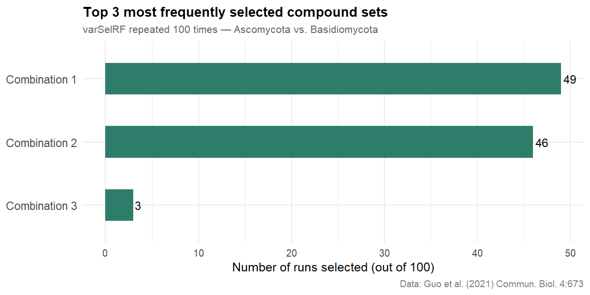

Fungal VOC profiles discriminate between phyla: a Random Forest approach
================
Lakshya Katariya
2026-06-01

## Overview

Fungi communicate chemically through volatile organic compounds (VOCs).
But do these scents encode something deeper — like *which phylum* a
fungus belongs to?

In [Katariya et
al. (2017)](https://link.springer.com/article/10.1007/s10886-017-0902-4),
we showed that fungus-farming termites discriminate their crop fungus
from a parasitic weed using VOC profiles alone — without visual contact.
Random Forest classification on GC-MS data identified the candidate
compounds driving that discrimination.

Here I apply the same analytical approach to a publicly-available
dataset from [Guo et
al. (2021)](https://doi.org/10.1038/s42003-021-02198-8), who measured
comprehensive VOC profiles from 43 fungal species. Using phylum-level
metadata from Supplementary Table S1, I compare **Ascomycota** and
**Basidiomycota** — the two major fungal phyla in the dataset — and ask:
do their VOC profiles differ systematically, and which compounds carry
the most discriminatory signal?

Random Forest is used here as a classification tool: the goal is to
identify candidate discriminating compounds, following the analytical
approach in Katariya et al. (2017).

------------------------------------------------------------------------

## Data source

- **Paper:** Guo et al. (2021). *Volatile organic compound patterns
  predict fungal trophic mode and lifestyle.* Communications Biology
  4:673.
- **VOC data:** Supplementary Table S4 (GC-MS emission intensities),
  available at <https://osf.io/bva2q>.
- **Metadata:** Supplementary Table S1 (phylum assignments), same
  source.

------------------------------------------------------------------------

## Setup

``` r
library(tidyverse)     # dplyr, tidyr, tibble, ggplot2, forcats
library(readxl)        # read Excel files
library(varSelRF)      # iterative variable selection via Random Forest
library(janitor)       # clean_names() for column name cleaning
library(parallel)      # detect available CPU cores
library(doParallel)    # parallel backend for foreach loops
library(foreach)       # foreach loop syntax
```

------------------------------------------------------------------------

## 1. Load and prepare VOC data

Table S4 has compounds as rows and fungal species as columns — the
transpose of what `randomForest()` expects. We drop the `Mean` and `SD`
summary columns, which are not individual observations. We also retain
only compounds with identified names, excluding rows where the compound
is recorded only as a mass-to-charge ratio (m/z), as these cannot be
meaningfully used downstream.

``` r
# Download TableS4 from https://osf.io/bva2q and place in your working directory
data_raw <- read_excel(
  path  = "TableS4_GCMSdata.xlsx",  # change name if required
  sheet = 1,
  skip  = 1        # row 1 is a description; row 2 becomes the header
)

data_clean <- data_raw %>%
  select(-matches("^Mean|^SD")) %>%   # drop summary columns
  clean_names() %>%
  filter(!str_detect(compounds, "^[0-9]"))  # keep named compounds only

head(data_clean)
```

    ## # A tibble: 6 × 159
    ##   compounds c_montecillanum_2 c_montecillanum_3 c_montecillanum_4 s_macrospora_7
    ##   <chr>                 <dbl>             <dbl>             <dbl>          <dbl>
    ## 1 Phenol               0                 0                 0               0    
    ## 2 monoterp…            0.0751            0.0604            0.131           0.102
    ## 3 monoterp…            0                 0                 0               0    
    ## 4 Myrcene              0                 0                 0               0    
    ## 5 (1R)-(+)…            0.0873            0.150             0.0987          0    
    ## 6 cis-Ocim…            0                 0                 0               0    
    ## # ℹ 154 more variables: s_macrospora_8 <dbl>, s_macrospora_9 <dbl>,
    ## #   s_macrospora_10 <dbl>, a_alternata_13 <dbl>, a_alternata_14 <dbl>,
    ## #   a_alternata_15 <dbl>, a_alternata_16 <dbl>, a_brassicicola_19 <dbl>,
    ## #   a_brassicicola_20 <dbl>, a_brassicicola_21 <dbl>, a_niger_24 <dbl>,
    ## #   a_niger_25 <dbl>, a_niger_26 <dbl>, a_niger_27 <dbl>, a_oryzae_30 <dbl>,
    ## #   a_oryzae_31 <dbl>, a_oryzae_32 <dbl>, a_oryzae_33 <dbl>,
    ## #   a_porphyria_36 <dbl>, a_porphyria_37 <dbl>, a_porphyria_38 <dbl>, …

------------------------------------------------------------------------

## 2. Extract species names

``` r
species_names <- colnames(data_clean) %>%
  setdiff("compounds") %>%
  str_remove("_[0-9]{1,3}$") %>%
  unique()

species_names
```

    ##  [1] "c_montecillanum"  "s_macrospora"     "a_alternata"      "a_brassicicola"  
    ##  [5] "a_niger"          "a_oryzae"         "a_porphyria"      "a_pullulans"     
    ##  [9] "b_cinerea"        "b_sorokiniana"    "c_glaucopus"      "c_globosum"      
    ## [13] "c_herbarum"       "d_teres"          "f_culmorum"       "f_graminearum"   
    ## [17] "f_oxysporum"      "g_candidum"       "h_annosum"        "l_bicolor"       
    ## [21] "m_bicolor"        "m_circinelloides" "m_racemosus"      "p_chrysosporium" 
    ## [25] "p_croceum"        "p_lilacinus"      "p_oxalicum"       "p_placenta"      
    ## [29] "p_squarrosa"      "r_oryzae"         "s_sclerotiorum"   "t_hamatum"       
    ## [33] "t_hirsuta"        "t_reesei"         "t_velutinum"      "t_versicolor"    
    ## [37] "t_zygodesmoides"  "thz_es891"        "thz_ms8a1"        "thz_wm24a1"      
    ## [41] "u_hordei"         "u_nuda"           "v_albo_atrum"

------------------------------------------------------------------------

## 3. Assign phylum labels from Supplementary Table S1

Phylum assignments are taken directly from Table S1 of Guo et
al. (2021). Zygomycota species (*Mucor circinelloides*, *Mucor
racemosus*, *Rhizopus oryzae*) are excluded — this analysis focuses on
the Ascomycota vs. Basidiomycota comparison.

``` r
phylum_labels <- tribble(
  ~ species_name,
  ~ phylum,
  # Ascomycota
  "c_montecillanum",
  "Ascomycota",
  "s_macrospora",
  "Ascomycota",
  "a_alternata",
  "Ascomycota",
  "a_brassicicola",
  "Ascomycota",
  "a_niger",
  "Ascomycota",
  "a_oryzae",
  "Ascomycota",
  "b_cinerea",
  "Ascomycota",
  "b_sorokiniana",
  "Ascomycota",
  "c_globosum",
  "Ascomycota",
  "c_herbarum",
  "Ascomycota",
  "d_teres",
  "Ascomycota",
  "f_culmorum",
  "Ascomycota",
  "f_graminearum",
  "Ascomycota",
  "f_oxysporum",
  "Ascomycota",
  "g_candidum",
  "Ascomycota",
  "m_bicolor",
  "Ascomycota",
  "p_lilacinus",
  "Ascomycota",
  "p_oxalicum",
  "Ascomycota",
  "s_sclerotiorum",
  "Ascomycota",
  "t_hamatum",
  "Ascomycota",
  "t_reesei",
  "Ascomycota",
  "t_velutinum",
  "Ascomycota",
  "thz_es891",
  "Ascomycota",
  "thz_ms8a1",
  "Ascomycota",
  "thz_wm24a1",
  "Ascomycota",
  "v_albo_atrum",
  "Ascomycota",
  # Basidiomycota
  "a_porphyria",
  "Basidiomycota",
  "c_glaucopus",
  "Basidiomycota",
  "h_annosum",
  "Basidiomycota",
  "l_bicolor",
  "Basidiomycota",
  "p_chrysosporium",
  "Basidiomycota",
  "p_croceum",
  "Basidiomycota",
  "p_placenta",
  "Basidiomycota",
  "p_squarrosa",
  "Basidiomycota",
  "t_hirsuta",
  "Basidiomycota",
  "t_versicolor",
  "Basidiomycota",
  "t_zygodesmoides",
  "Basidiomycota",
  "u_hordei",
  "Basidiomycota",
  "u_nuda",
  "Basidiomycota"
)

cat("Ascomycota species:",
    sum(phylum_labels$phylum == "Ascomycota"),
    "\n")
```

    ## Ascomycota species: 26

``` r
cat("Basidiomycota species:",
    sum(phylum_labels$phylum == "Basidiomycota"),
    "\n")
```

    ## Basidiomycota species: 13

------------------------------------------------------------------------

## 4. Filter and transpose to species x compounds format

Keep only columns belonging to Ascomycota and Basidiomycota. Remove
compounds not detected in any retained species (all-zero rows carry no
discriminatory information).

``` r
selected_species <- phylum_labels$species_name

data_selected <- data_clean %>%
  select(compounds, starts_with(selected_species)) %>%
  filter(if_any(-compounds, ~ .x != 0))

# Transpose: rows = replicates, columns = compounds
df_species <- data_selected %>%
  pivot_longer(cols      = -compounds,
               names_to  = "species",
               values_to = "emission") %>%
  mutate(species_name = str_remove(species, "_[0-9]{1,3}$")) %>%
  left_join(phylum_labels, by = "species_name") %>%
  mutate(phylum = as.factor(phylum)) %>%
  select(-species_name) %>%
  pivot_wider(names_from  = compounds, values_from = emission) %>%
  column_to_rownames("species") %>%
  mutate(across(-phylum, as.numeric)) %>%
  clean_names()

cat("Observations (replicates):", nrow(df_species), "\n")
```

    ## Observations (replicates): 142

``` r
cat("VOC features:", ncol(df_species) - 1, "\n")
```

    ## VOC features: 151

``` r
cat("Phyla compared:", paste(levels(df_species$phylum), collapse = " vs. "), "\n")
```

    ## Phyla compared: Ascomycota vs. Basidiomycota

``` r
cat("\nReplicates per phylum:\n")
```

    ## 
    ## Replicates per phylum:

``` r
print(table(df_species$phylum))
```

    ## 
    ##    Ascomycota Basidiomycota 
    ##            97            45

------------------------------------------------------------------------

## 5. Variable selection via varSelRF

`varSelRF` iteratively eliminates the least important variables, running
a new Random Forest at each step until a minimal discriminating set is
found. We repeat this 100 times (as in Katariya et al. 2017) to identify
which compound combinations are selected most consistently across runs.

This is computationally intensive. We parallelise across CPU cores,
leaving one core free to avoid system instability.

``` r
n_cores <- detectCores() - 1
cl <- makeCluster(n_cores)
registerDoParallel(cl)

cat("Running varSelRF across", n_cores, "cores...\n")
```

    ## Running varSelRF across 15 cores...

``` r
set.seed(42)

mod1res <- foreach(i         = 1:100,
                   .combine  = c,
                   .packages = "varSelRF") %dopar% {
                     varSelRF(xdata = df_species[, names(df_species) != "phylum"], Class = df_species$phylum)$selected.model
                   }

stopCluster(cl)
registerDoSEQ()

sort(summary(as.factor(mod1res)), decreasing = TRUE)
```

    ##                                          a_selinene + benzoic_acid_2_4_dimethyl_methyl_ester + cadina_1_4_diene + cis_hexahydrophthalide + duroquinone + g_collidine + g_muurolene + gymnomitrene + linalool + methyl_furoate + oxime_methoxy_phenyl + sativen + triacetin + x1r_trans_isolimonene 
    ##                                                                                                                                                                                                                                                                                                 49 
    ## a_muurolene + a_selinene + benzoic_acid_2_4_dimethyl_methyl_ester + cadina_1_4_diene + cis_hexahydrophthalide + duroquinone + g_collidine + g_muurolene + gymnomitrene + linalool + methyl_furoate + monoterpene_4 + oxime_methoxy_phenyl + sativen + triacetin + x1r_trans_isolimonene + ylangene 
    ##                                                                                                                                                                                                                                                                                                 46 
    ##   a_selinene + benzoic_acid_2_4_dimethyl_methyl_ester + cadina_1_4_diene + cis_hexahydrophthalide + duroquinone + g_collidine + g_elemene + g_muurolene + gymnomitrene + linalool + methyl_furoate + monoterpene_4 + oxime_methoxy_phenyl + sativen + triacetin + x1r_trans_isolimonene + ylangene 
    ##                                                                                                                                                                                                                                                                                                  3 
    ##                                                   a_selinene + benzoic_acid_2_4_dimethyl_methyl_ester + cadina_1_4_diene + duroquinone + g_collidine + g_muurolene + gymnomitrene + linalool + methyl_furoate + monoterpene_4 + oxime_methoxy_phenyl + sativen + triacetin + x1r_trans_isolimonene 
    ##                                                                                                                                                                                                                                                                                                  1 
    ##                                                        a_selinene + benzoic_acid_2_4_dimethyl_methyl_ester + cadina_1_4_diene + duroquinone + g_collidine + g_muurolene + gymnomitrene + linalool + methyl_furoate + oxime_methoxy_phenyl + sativen + triacetin + x1r_trans_isolimonene + ylangene 
    ##                                                                                                                                                                                                                                                                                                  1

The plot below shows the three most frequently selected compound
combinations across 100 runs. A dominant combination — selected in a
high proportion of runs — indicates a stable, reproducible
discriminating signal.

``` r
sort(summary(as.factor(mod1res)), decreasing = TRUE) %>%
  as.data.frame() %>%
  rownames_to_column("model") %>%
  rename(frequency = ".") %>%
  slice_head(n = 3) %>%
  mutate(combination = fct_reorder(paste0("Combination ", row_number()), frequency)) %>%
  ggplot(aes(x = combination, y = frequency)) +
  geom_col(fill = "#2E7D6B", width = 0.5) +
  geom_text(aes(label = frequency), hjust = -0.2, size = 4) +
  coord_flip() +
  labs(
    title    = "Top 3 most frequently selected compound sets",
    subtitle = "varSelRF repeated 100 times — Ascomycota vs. Basidiomycota",
    x        = NULL,
    y        = "Number of runs selected (out of 100)",
    caption  = "Data: Guo et al. (2021) Commun. Biol. 4:673"
  ) +
  theme_minimal(base_size = 12) +
  theme(
    plot.title    = element_text(face = "bold", size = 13),
    plot.subtitle = element_text(colour = "grey40", size = 10),
    plot.caption  = element_text(colour = "grey50", size = 9),
    axis.text.y   = element_text(size = 11)
  )
```

<!-- -->

Compound identities for each combination:

``` r
sort(summary(as.factor(mod1res)), decreasing = TRUE) %>%
  as.data.frame() %>%
  rownames_to_column("model") %>%
  rename(frequency = ".") %>%
  slice_head(n = 3) %>%
  mutate(combination = paste0("Combination ", row_number())) %>%
  select(combination, frequency, model)
```

    ##     combination frequency
    ## 1 Combination 1        49
    ## 2 Combination 2        46
    ## 3 Combination 3         3
    ##                                                                                                                                                                                                                                                                                                model
    ## 1                                          a_selinene + benzoic_acid_2_4_dimethyl_methyl_ester + cadina_1_4_diene + cis_hexahydrophthalide + duroquinone + g_collidine + g_muurolene + gymnomitrene + linalool + methyl_furoate + oxime_methoxy_phenyl + sativen + triacetin + x1r_trans_isolimonene
    ## 2 a_muurolene + a_selinene + benzoic_acid_2_4_dimethyl_methyl_ester + cadina_1_4_diene + cis_hexahydrophthalide + duroquinone + g_collidine + g_muurolene + gymnomitrene + linalool + methyl_furoate + monoterpene_4 + oxime_methoxy_phenyl + sativen + triacetin + x1r_trans_isolimonene + ylangene
    ## 3   a_selinene + benzoic_acid_2_4_dimethyl_methyl_ester + cadina_1_4_diene + cis_hexahydrophthalide + duroquinone + g_collidine + g_elemene + g_muurolene + gymnomitrene + linalool + methyl_furoate + monoterpene_4 + oxime_methoxy_phenyl + sativen + triacetin + x1r_trans_isolimonene + ylangene

------------------------------------------------------------------------

## 6. Fit full Random Forest on selected variables

`varSelRF` identifies the minimal discriminating compound set. We
extract the most frequently selected set (Combination 1) and fit a full
`randomForest()` on those variables to obtain importance scores,
proximity matrix, and OOB error.

``` r
best_model <- names(sort(summary(as.factor(mod1res)), decreasing = TRUE))[1]

selected_vars <- str_split(best_model, " \\+ ")[[1]] %>% trimws()
cat("Number of selected compounds:", length(selected_vars), "\n")
```

    ## Number of selected compounds: 14

``` r
set.seed(42)

rf_model <- randomForest(
  phylum ~ .,
  data       = df_species %>% select(phylum, all_of(selected_vars)),
  ntree      = 1000,
  importance = TRUE,
  proximity  = TRUE
)

print(rf_model)
```

    ## 
    ## Call:
    ##  randomForest(formula = phylum ~ ., data = df_species %>% select(phylum,      all_of(selected_vars)), ntree = 1000, importance = TRUE,      proximity = TRUE) 
    ##                Type of random forest: classification
    ##                      Number of trees: 1000
    ## No. of variables tried at each split: 3
    ## 
    ##         OOB estimate of  error rate: 6.34%
    ## Confusion matrix:
    ##               Ascomycota Basidiomycota class.error
    ## Ascomycota            97             0         0.0
    ## Basidiomycota          9            36         0.2

``` r
oob_rate <- rf_model$err.rate %>%
  as.data.frame() %>%
  slice_tail(n = 1) %>%
  pull(OOB)

cat("Final OOB error rate:", round(oob_rate * 100, 1), "%\n")
```

    ## Final OOB error rate: 6.3 %

------------------------------------------------------------------------

## 7. Which VOCs discriminate Ascomycota from Basidiomycota?

Mean Decrease in Accuracy measures how much model accuracy drops when a
compound’s values are randomly shuffled — compounds with high scores are
genuinely informative discriminators between the two phyla.

``` r
imp_df <- importance(rf_model, type = 1) %>%
  as.data.frame() %>%
  rownames_to_column("compound") %>%
  rename(importance = MeanDecreaseAccuracy) %>%
  arrange(desc(importance))

imp_df
```

    ##                                  compound importance
    ## 1                          methyl_furoate   34.92802
    ## 2                                linalool   29.82970
    ## 3                    oxime_methoxy_phenyl   24.51172
    ## 4                               triacetin   22.58691
    ## 5                             g_collidine   22.27806
    ## 6                             duroquinone   21.77807
    ## 7  benzoic_acid_2_4_dimethyl_methyl_ester   21.07023
    ## 8                              a_selinene   20.94076
    ## 9                            gymnomitrene   18.45585
    ## 10                  x1r_trans_isolimonene   17.91518
    ## 11                                sativen   17.65911
    ## 12                       cadina_1_4_diene   17.36227
    ## 13                            g_muurolene   16.01584
    ## 14                 cis_hexahydrophthalide   15.52421

``` r
ggplot(imp_df, aes(x = fct_reorder(compound, importance), y = importance)) +
  geom_col(fill = "#2E7D6B", width = 0.7) +
  coord_flip() +
  labs(
    title    = "VOCs discriminating Ascomycota vs. Basidiomycota",
    subtitle = "Random Forest: Mean Decrease in Accuracy (permutation importance)",
    x        = NULL,
    y        = "Mean decrease in accuracy",
    caption  = "Data: Guo et al. (2021) Commun. Biol. 4:673"
  ) +
  theme_minimal(base_size = 12) +
  theme(
    plot.title    = element_text(face = "bold", size = 13),
    plot.subtitle = element_text(colour = "grey40", size = 10),
    plot.caption  = element_text(colour = "grey50", size = 9)
  )
```

<!-- -->

------------------------------------------------------------------------

## 8. VOC-based replicate similarity (MDS)

The Random Forest proximity matrix captures which replicates co-occur in
terminal nodes most often — a non-parametric measure of similarity in
VOC space. Multidimensional scaling (MDS) projects this into two
dimensions, coloured by phylum. Clear separation of phyla in MDS space
would indicate that VOC profiles reliably encode phylogenetic identity —
consistent with the principle demonstrated in Katariya et al. (2017).

``` r
mds_coords <- cmdscale(1 - rf_model$proximity, k = 2)

mds_df <- mds_coords %>%
  as.data.frame() %>%
  rename(MDS1 = V1, MDS2 = V2) %>%
  rownames_to_column("species") %>%
  left_join(df_species %>%
              rownames_to_column("species") %>%
              select(species, phylum),
            by = "species")

phylum_colours <- c("Ascomycota" = "#D85A30",
                    "Basidiomycota" = "#1D9E75")

ggplot(mds_df, aes(
  x = MDS1,
  y = MDS2,
  colour = phylum,
  label  = species
)) +
  geom_point(size = 3.5, alpha = 0.85) +
  geom_text(size = 2.6,
            vjust = -0.8,
            alpha = 0.7) +
  scale_colour_manual(values = phylum_colours, name = "Phylum") +
  labs(
    title    = "VOC-based similarity of fungal replicates by phylum",
    subtitle = "MDS on Random Forest proximity matrix",
    x        = "MDS axis 1",
    y        = "MDS axis 2",
    caption  = "Data: Guo et al. (2021) Commun. Biol. 4:673"
  ) +
  theme_minimal(base_size = 12) +
  theme(
    plot.title      = element_text(face = "bold", size = 13),
    plot.subtitle   = element_text(colour = "grey40", size = 10),
    plot.caption    = element_text(colour = "grey50", size = 9),
    legend.position = "right"
  )
```

<!-- -->

------------------------------------------------------------------------

## 9. Robustness check: confusion matrix

The confusion matrix reveals whether misclassification is symmetric
across phyla or concentrated in one direction — important context for
interpreting the OOB error rate.

``` r
rf_model$confusion %>%
  as.data.frame() %>%
  rownames_to_column("true_phylum") %>%
  rename(`OOB error` = class.error)
```

    ##     true_phylum Ascomycota Basidiomycota OOB error
    ## 1    Ascomycota         97             0       0.0
    ## 2 Basidiomycota          9            36       0.2

------------------------------------------------------------------------

## Summary

- Phyla compared: **Ascomycota** (97 replicates) vs. **Basidiomycota**
  (45 replicates).
- `varSelRF` repeated 100 times identified a stable minimal set of
  discriminating VOCs (Combination 1 in the plot above).
- A Random Forest model fit on the selected compounds achieved an OOB
  error rate of **6.3%**.
- The MDS proximity plot shows whether replicates cluster by phylum in
  VOC space — consistent with the principle demonstrated in Katariya et
  al. (2017): that biological identity is encoded in volatile chemistry.

------------------------------------------------------------------------

## Session info

``` r
sessionInfo()
```

    ## R version 4.6.0 (2026-04-24 ucrt)
    ## Platform: x86_64-w64-mingw32/x64
    ## Running under: Windows 11 x64 (build 26200)
    ## 
    ## Matrix products: default
    ##   LAPACK version 3.12.1
    ## 
    ## locale:
    ## [1] LC_COLLATE=English_United States.utf8 
    ## [2] LC_CTYPE=English_United States.utf8   
    ## [3] LC_MONETARY=English_United States.utf8
    ## [4] LC_NUMERIC=C                          
    ## [5] LC_TIME=English_United States.utf8    
    ## 
    ## time zone: Europe/Brussels
    ## tzcode source: internal
    ## 
    ## attached base packages:
    ## [1] parallel  stats     graphics  grDevices utils     datasets  methods  
    ## [8] base     
    ## 
    ## other attached packages:
    ##  [1] doParallel_1.0.17    iterators_1.0.14     foreach_1.5.2       
    ##  [4] janitor_2.2.1        varSelRF_0.7-9       randomForest_4.7-1.2
    ##  [7] readxl_1.5.0         lubridate_1.9.5      forcats_1.0.1       
    ## [10] stringr_1.6.0        dplyr_1.2.1          purrr_1.2.2         
    ## [13] readr_2.2.0          tidyr_1.3.2          tibble_3.3.1        
    ## [16] ggplot2_4.0.3        tidyverse_2.0.0     
    ## 
    ## loaded via a namespace (and not attached):
    ##  [1] utf8_1.2.6         generics_0.1.4     stringi_1.8.7      hms_1.1.4         
    ##  [5] digest_0.6.39      magrittr_2.0.5     evaluate_1.0.5     grid_4.6.0        
    ##  [9] timechange_0.4.0   RColorBrewer_1.1-3 fastmap_1.2.0      cellranger_1.1.0  
    ## [13] scales_1.4.0       codetools_0.2-20   cli_3.6.6          rlang_1.2.0       
    ## [17] withr_3.0.2        yaml_2.3.12        otel_0.2.0         tools_4.6.0       
    ## [21] tzdb_0.5.0         vctrs_0.7.3        R6_2.6.1           lifecycle_1.0.5   
    ## [25] snakecase_0.11.1   pkgconfig_2.0.3    pillar_1.11.1      gtable_0.3.6      
    ## [29] glue_1.8.1         xfun_0.57          tidyselect_1.2.1   rstudioapi_0.18.0 
    ## [33] knitr_1.51         farver_2.1.2       htmltools_0.5.9    labeling_0.4.3    
    ## [37] rmarkdown_2.31     compiler_4.6.0     S7_0.2.2
